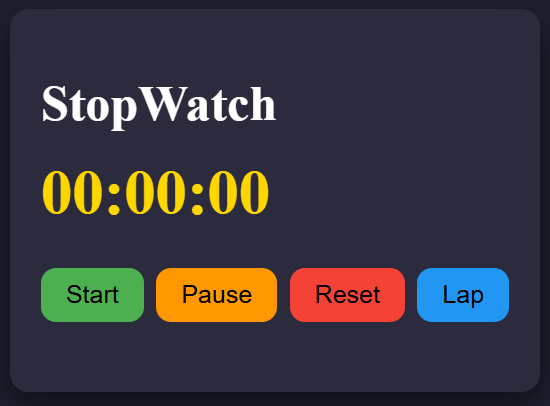

# ⏱️ Stopwatch

A simple **Stopwatch** built using **HTML, CSS, and JavaScript**. It allows users to start, pause, reset the timer, and record lap times.

## ✨ Features
- ▶️ Start the stopwatch
- ⏸️ Pause the stopwatch
- 🔄 Reset the stopwatch
- 🏁 Record lap times
- ⏱️ Displays time in `HH:MM:SS` format

## 🛠️ Technologies Used
- **HTML** – Structure
- **CSS** – Styling and layout
- **JavaScript** – Stopwatch functionality and DOM manipulation

## 🚀 How to Run
1. Clone the repository.
2. Open the project folder in VS Code.
3. Open `index.html` in your browser.

## 🎯 What I Learned
- JavaScript functions
- DOM manipulation
- Event listeners
- `setInterval()` and `clearInterval()`
- Creating and updating HTML elements dynamically

## 👤 Author

**Sunny Kumar**
- GitHub: (https://github.com/sunny1901kumar-sys)
- LinkedIn: (https://www.linkedin.com/in/sunny-kumar9540)